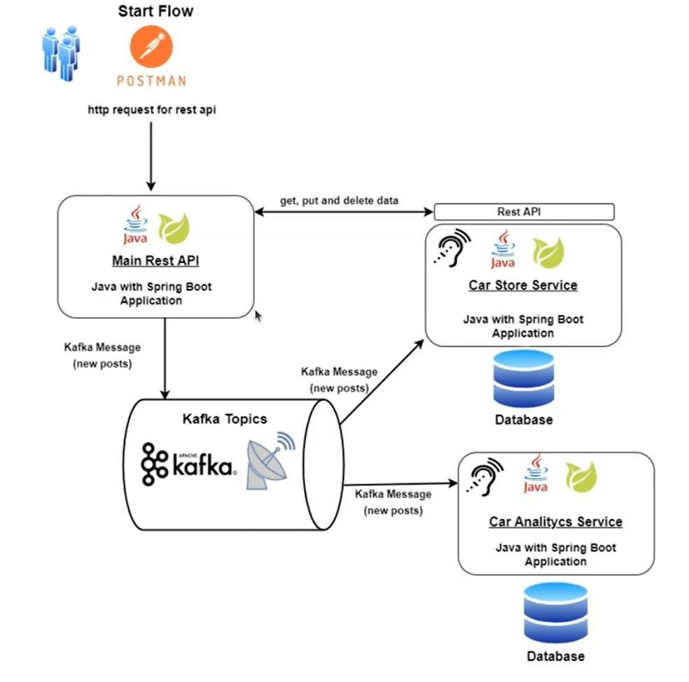

<h1 align="center">API Simuladora de Venda de Carros - Car Sales</h1>
O microservice 'api' é responsável por receber requisições e o processamento e persistência de dados ocorre na 'car', por fim, a 'data' recebe as informações e realiza a análise de dados.
<h2>💻 Arquitetura</h2>
<p align="center">
<br>
</p>
<h2>🚀 Rodar banco de dados</h2>
Para baixar a image do postgres via Docker, no cmd, efetue o seguinte comando:

```
docker pull postgres
```

Para executar o banco de dados via Docker:

```
docker run -p 5432:5432 -e POSTGRES_PASSWORD=1234 postgres
```

Para verificar os endpoints, clique neste link: <a href="[http://localhost:8085/swagger-ui/index.html#/]">http://localhost:8085/swagger-ui/index.html#</a>
<hr>
<a href = "mailto:contatodeboravicente@gmail.com"></a>
<a href="https://www.linkedin.com/in/deborasilvadlvs" target="_blank"></a> 
